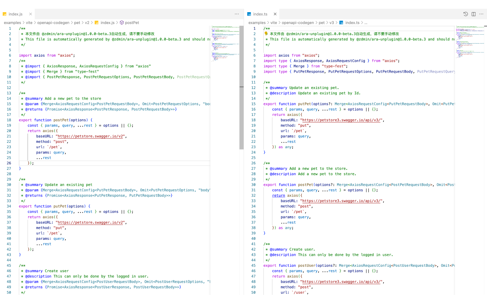

# @zdmin/ara [](https://deepwiki.com/xuyimingwork/zdmin-ara)

**TS/JS Code Gen is Ready Now!**



This project contains a set of tools for generating client api request code from OpenAPI specification.

## usage

### 1. Setup Project

install: `pnpm install -D @zdmin/ara-unplugin`

<details open>

<summary>Vite</summary>

```js
import { defineConfig } from 'vite'
import Ara from '@zdmin/ara-unplugin/vite'

// https://vite.dev/config/
export default defineConfig({
  plugins: [
    Ara({
      doc: 'https://petstore.swagger.io/'
    }),
    // ...
  ],
  // ...
})
```

</details>

<details>

<summary>Webpack</summary>

```js
import Ara from '@zdmin/ara-unplugin/webpack'

export default {
  plugins: [
    Ara({
      doc: 'https://petstore.swagger.io/'
    }),
    // ...
  ],
  // ...
};
```

</details>

- More Options: [@zdmin/ara-unplugin](./packages/unplugin/README.md)

- Examples: 
  - [vite example](./examples/vite)
  - [webpack example](./examples/webpack)

> for other client project: build your own server like [local-server](./packages/local-server/)

### 2. Download & Install Chrome Extension

We use Chrome Extension to providing seamless process of getting open api docs.

- 🚀 [Chrome Web Store](https://chromewebstore.google.com/detail/openapi-codegen/fjncpcopojccenmapbhicjcgeiabojli)

- **OR** if Chrome Web Store not latest, you can: 
  1. [download](https://cdn.jsdelivr.net/npm/@zdmin/ara-chrome-extension) manually and unzip it.
  2. [load-unpacked](https://developer.chrome.com/docs/extensions/get-started/tutorial/hello-world#load-unpacked) chrome extension.

### 3. Preview & Generate

- Visit doc page in Chrome then Open Chrome DevTools
- Preview & Generate Code from OpenAPI CodeGen


